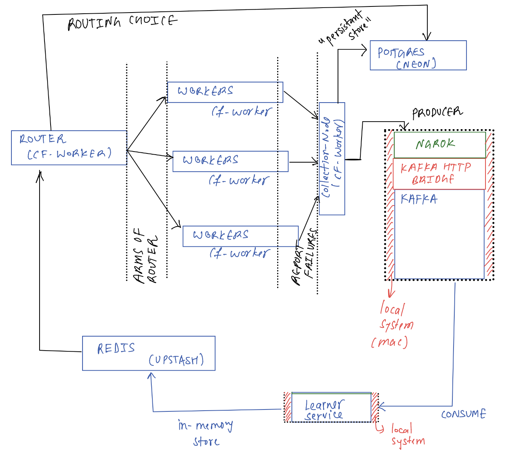
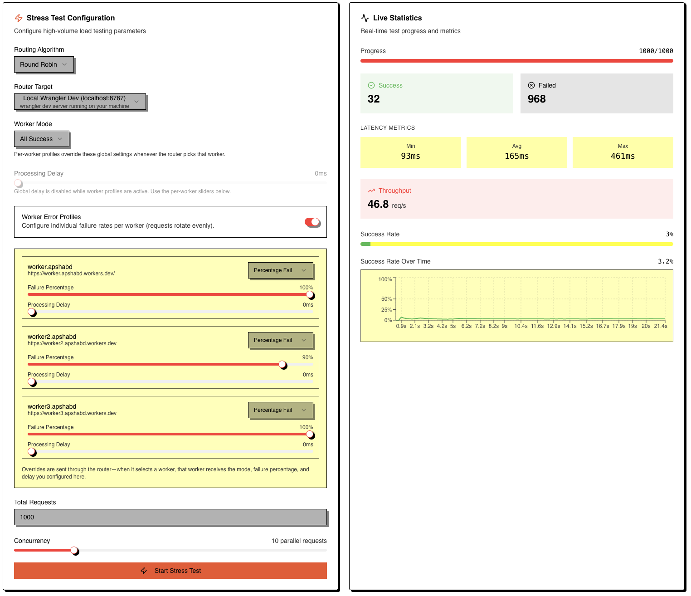
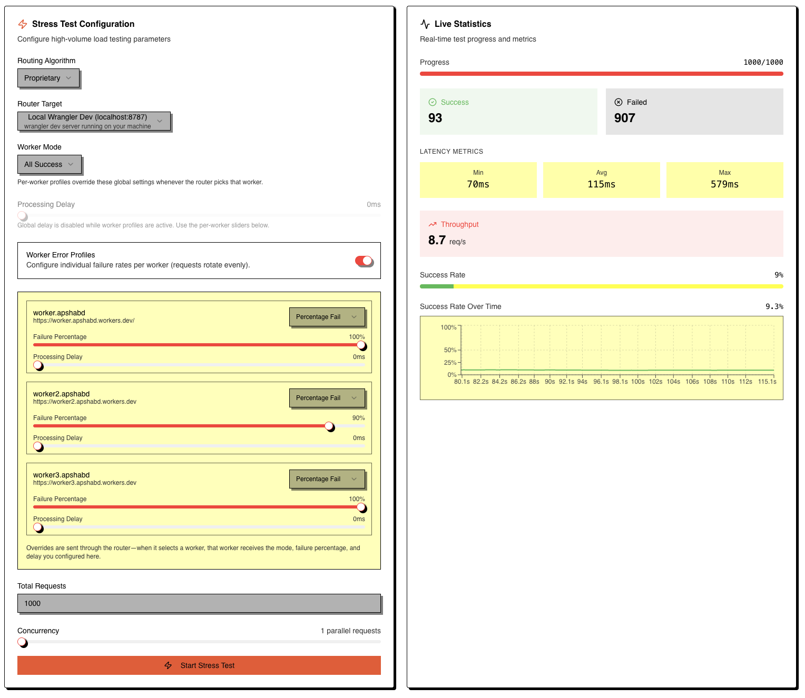

## Magnetar
(not an acronym)

- This is SLaB 2.0 and i am calling it magnetar, SLaB 1.0 was very close to being a vaiable MvP but it could't now i am trying again with a refined architecture, hope it succeeds.

- Current first draft vs where we landed (old on the left, new on the right)

  
  

- tl;dr: we started with a simple CF Worker router spraying requests + collecting 5xx via a “collector” worker and dumping into Postgres
- collector is just an abstraction, all workers directly publish telemetry to `telemetry topic in kafka and communicate via kafka-http-bridge`
- now telemetry goes straight from the router → Kafka REST proxy → Go learner (Thompson Sampling) → router, Redis stays only for round-robin state, and learners consume Kafka instead of relying on a fragile Redis buffer
- yup ngrok works for exposing the router but it rate-limits at ~400 req/min so I mostly run the router locally for stress tests (test-bed still has ngrok URLs baked in if you want to try it)

## How to run
### Step - 1
- cd into the worker dir
- change the name of `wrangler-example.jsonc` to `wrangler.jsonc`
- then change the default config as per your requirements
- then run `npm run deploy` for whatever number of workers you need 
- copy the deployed url and make sure to paste in `config/workers.json`
- Note : please change the name in `wrangler.jsonc` before deploying another worker as it will just oveeride your previous worker

### Step - 2 (router + telemetry)
- cd into `router`
- copy `wrangler-example.jsonc` to `wrangler.jsonc` if needed
- update the `vars` block for your own Kafka REST bridge / Redis / learner URL (for local dev we just point to `http://localhost:8082` + `http://localhost:8090`)
- `pnpm i` (or whatever you use) then `pnpm dev` / `pnpm deploy`
- Router now publishes telemetry for every request to Kafka → topic `telemetry`

### Step - 3 (Kafka stack)
- `cd kafka && docker compose up -d`
- please actually run that compose file, everything assumes those containers are up
- this spins up:
  - kafka broker (exposes `localhost:29092` for host clients, `magnetar-kafka:9092` for containers)
  - kafka-rest on `http://localhost:8082`
  - kafka-ui on `http://localhost:8080`
- open Kafka UI (8080) and create the `telemetry` topic manually (router publishes there, learner consumes it)

### Step - 4 (learner aka Thompson Sampling brain)
- `cd learner`
- `go run .` (default env already points to `localhost:29092` + `:8090`)
- learner exposes:
  - `GET /recommendation` (router hits this when `algo=proprietry`)
- if learner is down, router falls back to round robin/random so nothing explodes

### Step - 5 (test-bed vibes)
- `cd test-bed`
- `pnpm i`
- `pnpm dev`
- this UI lets you set failure sliders per worker and run stress tests to compare algos (see screenshots in docs/images)

## Stress test receipts
- round robin with two workers at 100% fail + one at 90% fail lands around 3% success
  
- thompson sampling shifts traffic toward the least-bad worker and sits closer to 10% success under the same setup
  
- randomness PSA: workers in `percentage_fail` mode literally flip a coin per request (`Math.random() * 100 < PERCENTAGE_FAIL`), so the proprietary line wiggles a few points because it keeps hammering the same “least awful” worker; round robin stays glued to its theoretical limit because it splits traffic evenly (two workers contribute 0%, the third contributes whatever its slider says)
